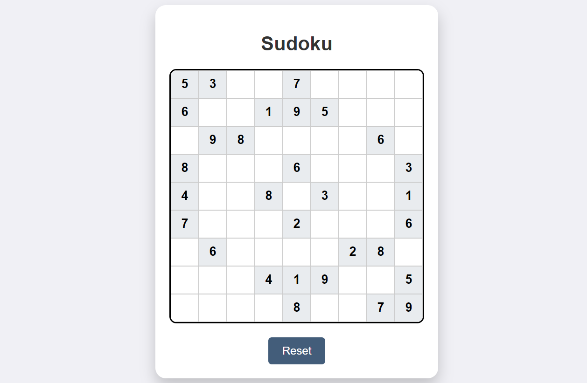

## JavaScript Proejcts

This repository contains JavaScript projects developed to practice and demonstrate various web development skills. Each project includes its source code and related resources.

## Table of Contents
- [Projects](#projects)
  - [BMI Generator](#bmi-generator)
  - [Color Flipper](#color-flipper)
  - [Color Changer](#color-changer)
  - [Countdown Timer](#countdown-timer)
  - [Currency Converter](#currency-converter)
  - [Decimal to Binary](#decimal-to-binary)
  - [Guess the Country](#guess-the-country)
  - [Guess the Number](#guess-the-number)
  - [Habit Tracker](#habit-tracker)
  - [JavaScript TypeScript Problems](#javascript-typescript-problems)
  - [Random Password Generator](#random-password-generator)
  - [Scientific Calculator](#scientific-calculator)
  - [Sudoku](#sudoku)
- [How to Run](#how-to-run)
- [Contributing](#contributing)

## Projects

### BMI Generator
**Description:** A tool for calculating Body Mass Index (BMI) based on user input of height and weight, providing a health categorization.

**Technologies:** HTML, CSS, JavaScript

**Features:**
- User input for height and weight
- BMI calculation and health category display

### Color Flipper
**Description:** A web app that changes the background color randomly or based on predefined color arrays.

**Technologies:** HTML, CSS, JavaScript

**Features:**
- Random color generation
- Predefined color mode

### Color Changer
**Description:** An extension of the Color Flipper with more color options and customizable features.

**Technologies:** HTML, CSS, JavaScript

**Features:**
- Expanded color palette
- User interface enhancements

### Countdown Timer
**Description:** A countdown timer that allows users to set a target date and time, counting down to the specified moment.

**Technologies:** HTML, CSS, JavaScript

**Features:**
- Date and time input
- Real-time countdown display

### Currency Converter
**Description:** Converts currency based on real-time exchange rates fetched from an API.

**Technologies:** HTML, CSS, JavaScript

**API Used:** ExchangeRate-API

**Features:**
- Multiple currency selection
- Real-time exchange rate updates

### Decimal to Binary
**Description:** A utility that converts decimal numbers into a binary representation.

**Technologies:** HTML, CSS, JavaScript

**Features:**
- Decimal input
- Binary output display

### Guess the Country
**Description:** An educational game where users guess countries based on their flags.

**Technologies:** HTML, CSS, JavaScript

**Features:**
- Interactive flag display
- User input for guessing

### Guess the Number
**Description:** A guessing game where the player tries to guess a randomly generated number within a range.

**Technologies:** HTML, CSS, JavaScript

**Features:**
- Random number generation
- User input and feedback

### Habit Tracker
**Description:** Helps users track daily habits and visualize progress over time.

**Technologies:** HTML, CSS, JavaScript

**Features:**
- Habit input and tracking
- Progress visualization

### JavaScript TypeScript Problems
**Description:** Solutions to common JavaScript and TypeScript coding challenges, including problem-solving techniques.

**Technologies:** JavaScript, TypeScript

**Features:**
- Problem descriptions and solutions
- Code optimization tips

### Random Password Generator
**Description:** Generates random passwords with customizable options for length and character types.

**Technologies:** HTML, CSS, JavaScript

**Features:**
- Customizable password length
- Inclusion of special characters, numbers, and letters

### Scientific Calculator
**Description:** A comprehensive calculator that includes basic and advanced functions like trigonometry and logarithms.

**Technologies:** HTML, CSS, JavaScript

**Features:**
- Standard and scientific calculation modes
- Advanced mathematical functions

### Sudoku
**Description:** A web-based version of the popular Sudoku puzzle game, including different difficulty levels.

**Technologies:** HTML, CSS, JavaScript

**Features:**
- Puzzle generation
- Difficulty levels



## How to Run
Clone the repository and navigate to the desired project's folder. Open the `index.html` file in a web browser to view the project.

```bash
git clone https://github.com/areebaqamar021/Js-projects.git
cd Js-projects
```
Navigate to the desired project folder and open index.html

## Contributing
Contributions are welcome! If you have suggestions or improvements, please fork the repository, create a pull request, or open an issue.
